# devops-netology
Учебный репозиторий
Отредактируйте файл README.md любым удобным способом, тем самым переведя файл в состояние Modified.

## Игнорируемые файлы

Благодаря добавленным файлам `.gitignore`, Git не будет отслеживать:
- временные файлы и каталоги Terraform (`.terraform/`, `*.tfstate`, `*.tfstate.backup`);
- локальные файлы конфигурации (`.terraformrc`, `override.tf`, `override.tf.json`);
- чувствительные данные вроде планов и кешей;
- и другие временные файлы, не относящиеся к исходному коду проекта.


# Домашнее задание к занятию «Системы контроля версий» - Иванов Сергей

## Цель задания
В результате выполнения задания вы:
* научтесь подготоваливать новый репозиторий к работе;
* сохранять, перемещать и удалять файлы в системе контроля версий.

### Чеклист готовности к домашнему заданию
1. Установлена консольная утилита для работы с Git.

### Инструкция к заданию
1. Домашнее задание выполните в GitHub-репозитории.
2. В личном кабинете отправьте на проверку ссылку на ваш репозиторий с домашним заданием.
3. Любые вопросы по решению задач задавайте в чате учебной группы.

## Задание 1. Создать и настроить репозиторий для дальнейшей работы на курсе
В рамках курса вы будете писать скрипты и создавать конфигурации для различных систем, которые необходимо сохранять для будущего использования. Сначала надо создать и настроить локальный репозиторий, после чего добавить удалённый репозиторий на GitHub.

### Создание репозитория и первого коммита
1. Зарегистрируйте аккаунт на https://github.com/. Если предпочитаете другое хранилище для репозитория, можно использовать его.

***Ответ:***

Аккаунт у меня давно зарегистрирован и существует на github.com

2. Создайте публичный репозиторий, который будете использовать дальше на протяжении всего курса, желательное с названием devops-netology. Обязательно поставьте галочку Initialize this repository with a README.

***Ответ:***

На платформе GitHub был создан новый публичный репозиторий с названием devops-netology.
При создании была выбрана опция Initialize this repository with a README, благодаря чему в репозитории сразу появился файл README.md.
Это позволило автоматически инициализировать репозиторий с основной веткой main и первым коммитом от GitHub.

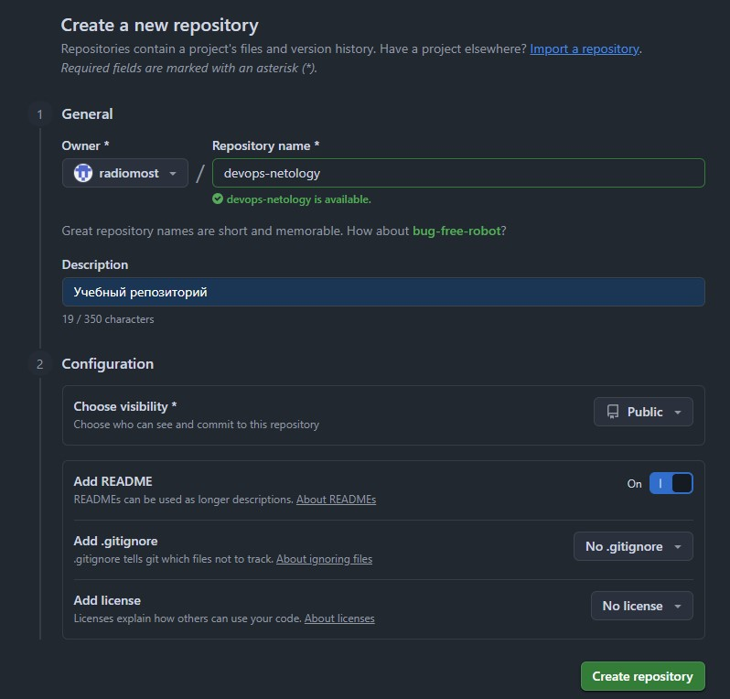

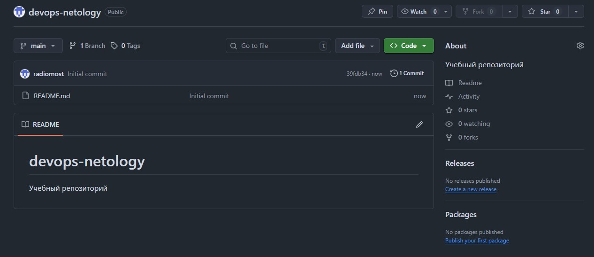

3. Создайте авторизационный токен для клонирования репозитория.

***Ответ:***

Для безопасной работы по протоколу HTTPS был создан fine-grained personal access token.
При создании токена были указаны следующие параметры:
* **Token name:** DevOps
* **Repository access:** только для выбранного репозитория devops-netology
* **Permissions:** в разделе Repository — Contents: Read and write (для возможности выполнять git push и git pull)
* **Expiration:** задан срок действия токена.
Токен был сохранён и используется для авторизации в Git при клонировании и отправке изменений.

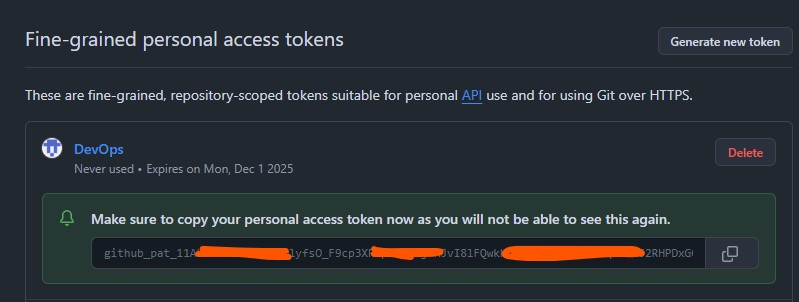

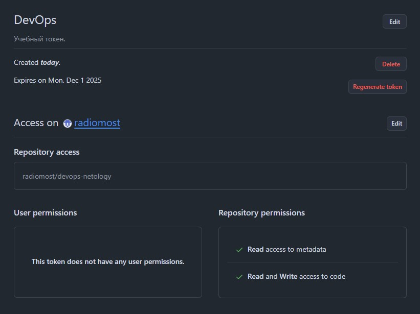

4. Склонируйте репозиторий, используя протокол HTTPS (git clone ...).

***Ответ:***

Репозиторий был склонирован на локальную машину с использованием HTTPS-ссылки:

```bash
git clone https://github.com/radiomost/devops-netology.git
```

В процессе аутентификации в качестве логина был указан GitHub username, а в качестве пароля — созданный ранее токен.
После клонирования в рабочем каталоге появилась папка **devops-netology**, содержащая файл **README.md**.

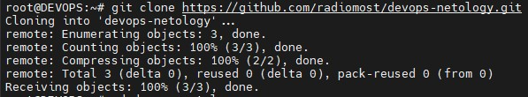

5. Перейдите в каталог с клоном репозитория (cd devops-netology).

***Ответ:***

Был выполенен переход в директорию репозитория

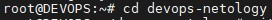

6. Произведите первоначальную настройку Git, указав своё настоящее имя, чтобы нам было проще общаться, и email (git config --global user.name и git config --global user.email johndoe@example.com).

***Ответ:***

Выполнена первичная настройка глобальных параметров пользователя:

```bash
git config --global user.name "Имя Фамилия"
git config --global user.email "email@example.com"
```

Эти данные будут автоматически добавляться в метаданные всех будущих коммитов.

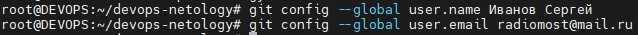

7. Выполните команду git status и запомните результат.

***Ответ:***

После клонирования была выполнена команда:

```bash
git status
```

Git сообщил:

```bash
On branch main
Your branch is up to date with 'origin/main'.

nothing to commit, working tree clean
```

Это означало, что рабочее дерево полностью совпадает с удалённым репозиторием и нет изменений.

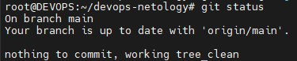


8. Отредактируйте файл README.md любым удобным способом, тем самым переведя файл в состояние Modified.

***Ответ:***

Файл **README.md** был открыт в текстовом редакторе, в него были внесены изменения.


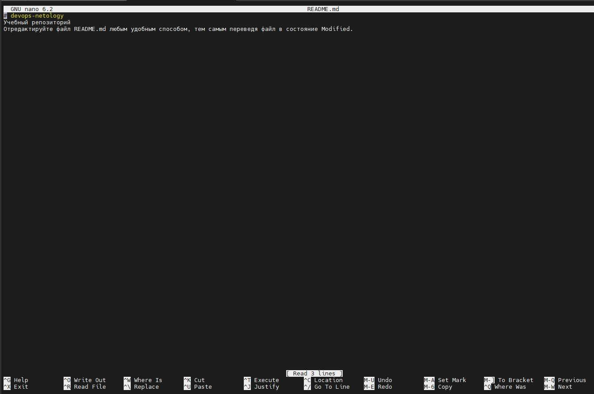

9. Ещё раз выполните **git status** и продолжайте проверять вывод этой команды после каждого следующего шага.

***Ответ:***

После сохранения изменений команда **git status** показала, что файл находится в состоянии **modified** — то есть изменён, но ещё не добавлен в индекс (**staging area**).

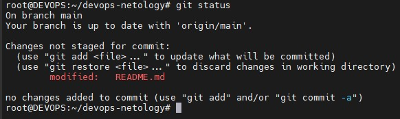

10. Теперь посмотрите изменения в файле README.md, выполнив команды git diff и git diff --staged.

***Ответ:***

Для просмотра разницы между текущей версией файла и последним коммитом была использована команда:

```bash
git diff
```

Вывод показал конкретные изменения, внесённые в README.md — какие строки были добавлены, изменены или удалены.

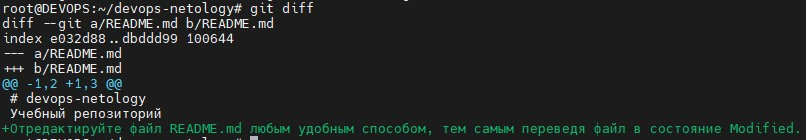

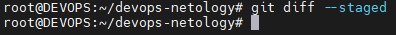

11. Переведите файл в состояние staged (или, как говорят, просто добавьте файл в коммит) командой **git add README.md**.

***Ответ:***

Далее файл был добавлен в **staging-область**:

```bash
git add README.md
```

После этого повторная проверка:

```bash
git status
```

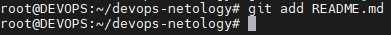

12. И ещё раз выполните команды git diff и git diff --staged. Поиграйте с изменениями и этими командами, чтобы чётко понять, что и когда они отображают.

***Ответ:***

Для анализа подготовленных изменений была выполнена команда:

```bash
git diff --staged
```

Она показала различия между индексом (**staging area**) и последним коммитом — именно эти изменения должны были попасть в новый коммит.

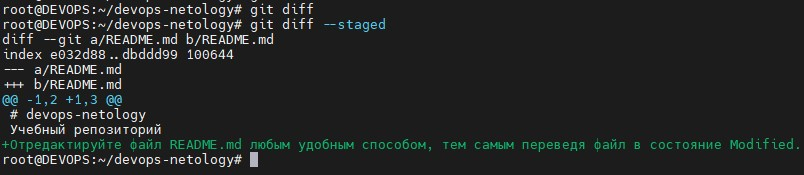

13. Теперь можно сделать коммит **git commit -m 'First commit'**.

***Ответ:***

Создание первого коммита
После проверки изменений был выполнен коммит:

```bash
git commit -m "First commit"
```
Команда зафиксировала все изменения, находившиеся в **staging area**, и создала новый коммит с указанным сообщением.

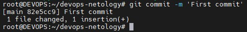

14. И ещё раз посмотреть выводы команд git status, git diff и git diff --staged.

***Ответ:***


После коммита команда git status вернула:

```bsh
On branch main
Your branch is ahead of 'origin/main' by 1 commit.
  (use "git push" to publish your local commits)

nothing to commit, working tree clean
```

Это означало, что:
* Локальный репозиторий содержит новый коммит.
* Рабочее дерево чистое (все изменения зафиксированы).
* Коммит ещё не отправлен на GitHub.


## Создание файлов .gitignore и второго коммита
1. Создайте файл .gitignore (обратите внимание на точку в начале файла), проверьте его статус сразу после создания.

***Ответ:***

Был создан файл **.gitignore** в корне репозитория с помощью команды touch **.gitignore**.
Особое внимание было уделено точке в начале имени файла — это стандарт Git для скрытых файлов конфигурации, которые содержат список файлов и каталогов, исключаемых из контроля версий.

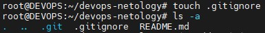


2. Добавьте файл .gitignore в следующий коммит (git add...).

***Ответ:***

Файл был добавлен в staging с помощью команды:

```bash
git add .gitignore
```
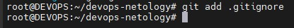

3. На одном из следующих блоков вы будете изучать Terraform, давайте сразу создадим соотвествующий каталог terraform и внутри этого каталога — файл .gitignore по примеру: https://github.com/github/gitignore/blob/master/Terraform.gitignore.

***Ответ:***

Для последующей работы с **Terraform** был создан каталог:

```bash
mkdir terraform
```

Внутри этого каталога был создан файл **.gitignore**, в который было скопировано содержимое с официального репозитория GitHub по ссылке.

**Назначение файла:**
* Исключать из контроля версий временные файлы Terraform, такие как .terraform/
* Игнорировать локальные файлы состояния (*.tfstate, *.tfstate.backup)
* Исключать файлы конфигурации пользователя (override.tf, *.tfvars)
* Исключать кеши, лог-файлы и другие временные данные, создаваемые Terraform во время работы

Файл .gitignore внутри каталога terraform был добавлен в staging с помощью:

```bash
git add terraform/.gitignore
```

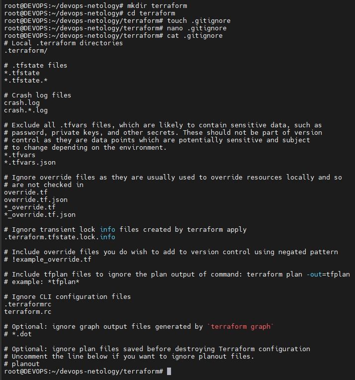

4. В файле **README.md **опишите своими словами, какие файлы будут проигнорированы в будущем благодаря добавленному **.gitignore**.

***Ответ:***

В файле **README.md** было добавлено описание того, какие файлы и каталоги будут игнорироваться благодаря созданным **.gitignore**:

```markdown
Благодаря добавленным файлам `.gitignore`, Git не будет отслеживать:
- временные файлы и каталоги Terraform (`.terraform/`, `*.tfstate`, `*.tfstate.backup`);
- локальные файлы конфигурации (`.terraformrc`, `override.tf`, `override.tf.json`);
- чувствительные данные вроде планов и кешей;
- и другие временные файлы, не относящиеся к исходному коду проекта.
```

5. Закоммитьте все новые и изменённые файлы. Комментарий к коммиту должен быть Added gitignore.

***Ответ:***

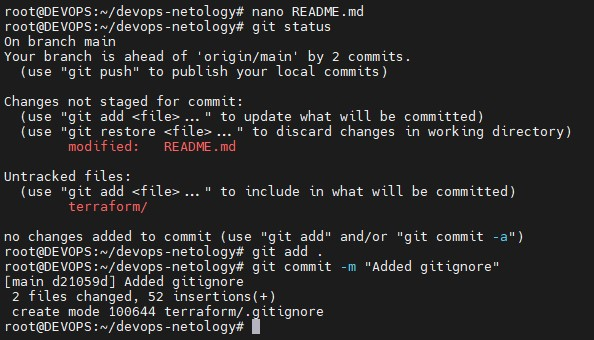

После редактирования **README.md** изменения были добавлены в staging:

```bash
git add .
```

Команда **git status** показала, что в **staging** находятся:
* terraform/.gitignore
* README.md

Все подготовленные файлы были зафиксированы в репозитории командой:

```bash
git commit -m "Added gitignore"
```
**Результат:**

* В репозитории появился второй коммит с сообщением **“Added gitignore”**.
* Все новые *.gitignore и обновленный **README.md** зафиксированы.
* После коммита рабочее дерево очистилось.

## Итог:

В результате выполненных действий:
* Создан **.gitignore** в корне проекта для исключения ненужных файлов из контроля версий.
* Создан каталог **terraform** и **.gitignore** внутри него для игнорирования временных и локальных файлов **Terraform**.
* Обновлён **README.md** с описанием игнорируемых файлов.
* Все новые и измененные файлы зафиксированы во втором коммите с сообщением **“Added gitignore”.**
Таким образом, репозиторий подготовлен для безопасной работы с **Terraform** и другими проектными файлами, исключая ненужные временные файлы из контроля версий.

## Эксперимент с удалением и перемещением файлов (третий и четвёртый коммит)

1. Создайте файлы will_be_deleted.txt (с текстом will_be_deleted) и will_be_moved.txt (с текстом will_be_moved) и закоммите их с комментарием Prepare to delete and move.

***Ответ:***

В репозитории были созданы два новых текстовых файла:

    1. will_be_deleted.txt — содержимое: will_be_deleted
    2. will_be_moved.txt — содержимое: will_be_moved

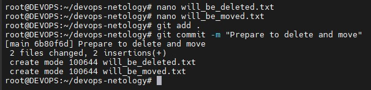

После создания оба файла были добавлены в **staging** и зафиксированы в репозитории командой:

```bash
git add will_be_deleted.txt will_be_moved.txt
git commit -m "Prepare to delete and move"
```

**Результат:**

* Создан третий коммит с сообщением **“Prepare to delete and move”**
* Репозиторий содержит два новых файла, готовых для дальнейшей работы с ними.

2. В случае необходимости обратитесь к официальной документации — здесь подробно описано, как выполнить следующие шаги.

***Ответ:***
Ознакомился

3. Удалите файл will_be_deleted.txt с диска и из репозитория.

***Ответ:***

Файл был удалён как из рабочего каталога, так и из индекса Git:

```bash
git rm will_be_deleted.txt
```

Команда **git status** показала:

```bash
Changes to be committed:
deleted: will_be_deleted.txt
```
Это означало, что Git отслеживает удаление файла и подготовлен к фиксации этого изменения в следующем коммите.

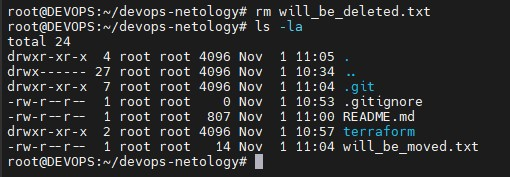

4. Переименуйте (переместите) файл will_be_moved.txt на диске и в репозитории, чтобы он стал называться has_been_moved.txt.

***Ответ:***

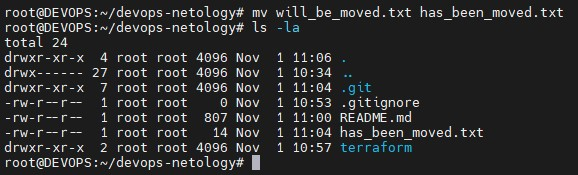

Файл был переименован на диске и в репозитории:

```bash
git mv will_be_moved.txt has_been_moved.txt
```

Проверка перименования в папке:

```bash
ls -la
```

5. Закоммитьте результат работы с комментарием Moved and deleted.

***Ответ:***

Все подготовленные изменения (удаление и переименование файлов) были зафиксированы в репозитории командой:

```bash
git commit -m "Moved and deleted"
```

**Результат:**
* Создан четвёртый коммит с сообщением “Moved and deleted”.
* В репозитории теперь:
    * Файл will_be_deleted.txt удалён полностью.
    * Файл will_be_moved.txt переименован в has_been_moved.txt.

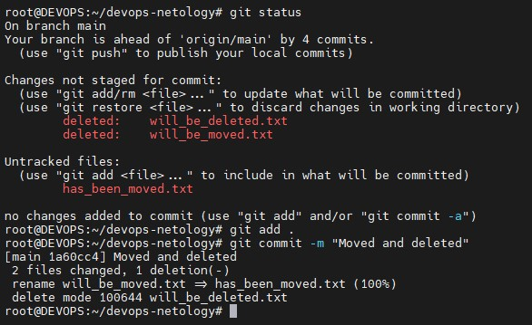

**Итог**

В результате проведённого эксперимента:
* На практике была отработана работа с удалением файлов с помощью **git rm**.
* Была выполнена перемена имени файла через, что автоматически отслеживается Git.
* Все изменения зафиксированы отдельным коммитом с понятным комментарием, что позволяет легко отслеживать историю проекта.
* Репозиторий теперь отражает фактическое состояние файлов: один файл удалён, другой переименован.

Таким образом, эксперимент успешно демонстрирует работу Git с удалением и перемещением файлов, включая подготовку изменений в **staging** и создание коммита.

## Проверка изменения
1 .В результате предыдущих шагов в репозитории должно быть как минимум пять коммитов (если вы сделали ещё промежуточные — нет проблем):
* **Initial Commit** — созданный GitHub при инициализации репозитория.
* **First commit** — созданный после изменения файла **README.md.**
* **Added gitignore** — после добавления **.gitignore**.
* **Prepare to delete and move** — после добавления двух временных файлов.
* **Moved and deleted** — после удаления и перемещения временных файлов.
2. Проверьте это, используя комманду **git log**. Подробно о формате вывода этой команды мы поговорим на следующем занятии, но посмотреть, что она отображает, можно уже сейчас.

***Ответ:***

 В результате, мы видим логи коммитов в  порядке, описанном в п.1.

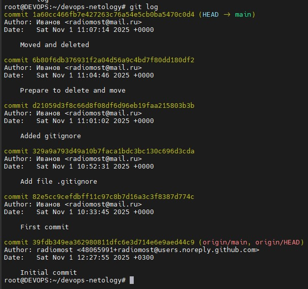

## Отправка изменений в репозиторий
Выполните команду **git push**, если Git запросит логин и пароль — введите ваши логин и пароль от GitHub.

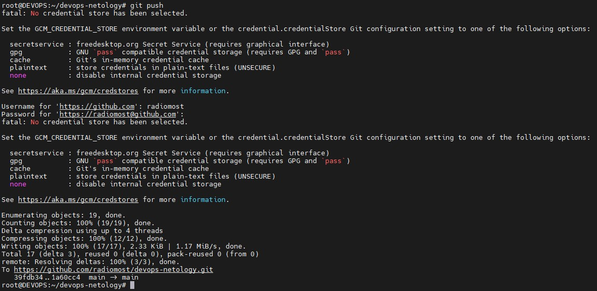

В качестве результата отправьте ссылку на репозиторий.

```bash
git clone https://github.com/radiomost/devops-netology.git
```